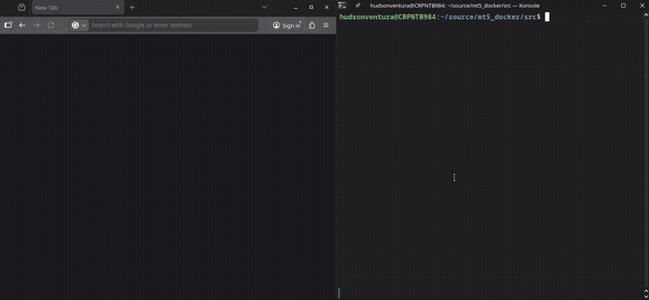
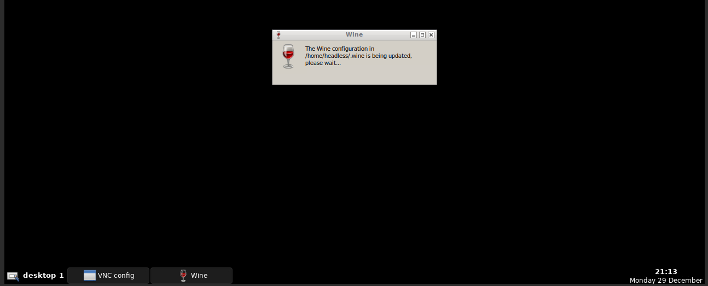
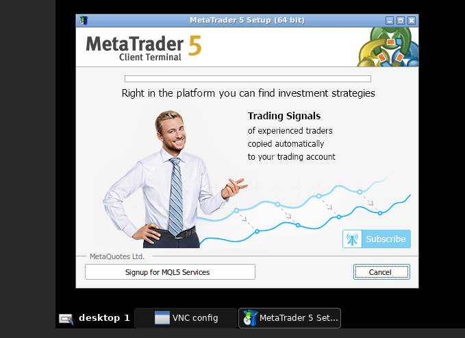
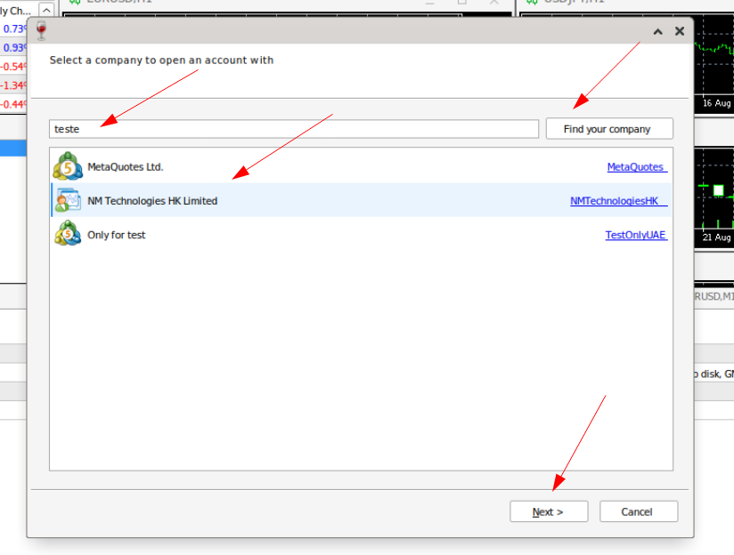

# MT5 Docker
Run MetaTrader 5 (MT5) in a Docker container.  


This project runs the MT5 application inside a Docker container using Wine as a compatibility layer. The container typically consumes around 500MB of RAM (depending of broker). It's possible to run multiple containers simultaneously, each one with a separate MT5 account connected to differents brokers.  
An watchdog ensures that if MT5 crashes, the container exits as well, allowing Docker to automatically restart it and maintain uptime.





# Getting Stated
Create a file `docker-compose.yml` with content below or download using:
``` bash
wget https://raw.githubusercontent.com/hudsonventura/MT5_Docker/refs/heads/main/src/docker-compose.yml
```


``` yaml
services:

  mt5:
    image: hudsonventura/mt5:2.0
    build:
       context: ./
       dockerfile: ./Dockerfile

    ports:
      - "5901:5901" #VNC
      - "6901:6901" #noVNO (via browser: http://localhost:6901/vnc.html or http://localhost:6901/vnc.html?password=my_vnc_password)

    environment:
     - VNC_PW=my_vnc_password #VNC password. Change it as you like

    volumes:
      - ./.data/MQL5/:/home/headless/.wine/drive_c/Program Files/MetaTrader 5/MQL5/

    # Uncomment if you are using a .ini file to connect with your broker automatically, see section `After Install`
    #  - ./mt5.ini:/home/headless/.wine/drive_c/Program Files/MetaTrader 5/mt5.ini

    # Uncomment if you are using a non listed broker and you have a problema with it, see section `After Install`
    #  - ./.data/MQL5/servers.dat:/home/headless/.wine/drive_c/Program Files/MetaTrader 5/Config/servers.dat 
      
    # Optional parameters:
    command: "/start.sh"       # This will start the VNC, noVNC, and MT5. If MT5 is closed, the container will shut down
    restart: always            # Automatically restarts the container if it stops
    mem_limit: 1024m           # Best practice. The container typically uses around 600MB
```

So:
``` bash
docker compose up
```

## Accessing the container

#### You can access the container via noVNC via browser
Go to this URL and type password manually:
```
http://localhost:6901/vnc.html
```

Or try this link to skip typing the password:
```
http://localhost:6901/vnc.html?password=my_vnc_password
```
#### You can access the container via common VNC client app
Open your favorite VNC client app and use this address:
```
localhost:5901
```
That's it!

---
---
---


# Build
If you are building you own version, follow the steps below. If you using the version from DockerHub, skip this section.  
<br />
Build with `docker compose up --build`. Wait a while.  
When finished, go to `http://localhost:6901/vnc.html`and put your VNC password.

If the MT5 installer doesn't start by it self, goto `/home/headless` (or just open the Home shotcut on XFCE desktop). Execute `mt5setup.exe` (double click).  


A few seconds after, the MT5 installer will start. 




The container may restart after the instalation.  


# After install
The MT5 has a strange limitation: you cannot connect to an account unless you have searched for the server first. If you are using the DockerHub image, I have already searched for many servers, but not all of them. So, you may need to access MT5 via VNC, check if your server is listed, and if not, search for it manually.  
There is and automation on files `start.sh`, but maybe your broker is not listed there. So go ahead in this section.  




Use the volume `/home/headless/.wine/drive_c/Program Files/MetaTrader 5/Config/servers.dat` if you have another server that is not listed, and make sure to persist it on disk. If you don’t persist it, when you bring down Docker Compose, your broker server information will be lost, and your MT5 will not connect automatically. 


### .ini file
Maybe you want to use .ini file to connect with your broker automatically.  
So, see and example on `srv/mt5.ini`.  On the first three lines, you can set your login, pass and server string.  

```ini
[Common]
Login=123456
Password=YourStr0ngP@ss
Server=Test-MT5-Demo
```

See on `srv/mt5.ini` another things you can use. 
Whole docs in [https://www.metatrader5.com/en/terminal/help/start_advanced/start](https://www.metatrader5.com/en/terminal/help/start_advanced/start)  


# Technology Stack

This project leverages a combination of technologies to run MT5 in a containerized environment with remote access capabilities. See the apps layers:

- **OS:** `Ubuntu 24.04.3 LTS` - Base Linux distribution providing the foundation for the container
- **GUI:**`Openbox 3.6.1` - Lightweight window manager providing the desktop environment inside the container
- **Access:**`TigerVNC` - VNC server for remote desktop access (port 5901)
- **Access:**`noVNC 1.4.0` - Browser-based VNC client enabling access via web browser (port 6901)
- **Compatibility Layer:**`Wine 10.0` - Windows compatibility layer that allows running Windows applications (MT5) on Linux
- **App:**`MetaTrader 5` - Trading platform with auto-update capability


# Release Notes

### 2.0
 - Change from accetto build to manually created ubuntu + Openbox + nVNC.  
 - From arround 600MB to 500MB of RAM consumption.  
 - Fixed bug where MT5 was not responding a mouse click after some seconds working.

 ### 2.1
 - New console message styles.
 - Image optimization: the Docker image no longer includes MT5. It will be downloaded on the first run and the latest version will be installed automatically.
 - Reduced Docker image size.
 - The `servers.dat` file (which contains the server URLs) will be downloaded from GitHub on the first run and kept up to date.
