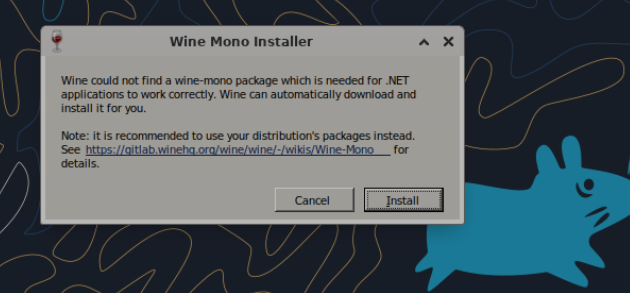
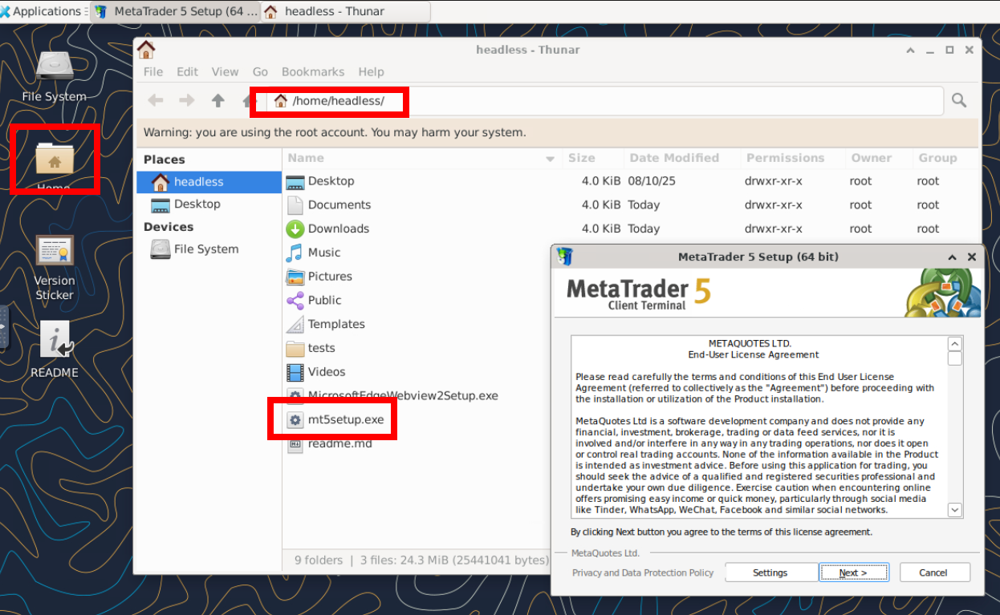

# metatrader_in_container
Run MT5 in a Docker container.  


This project runs the MT5 application inside a Docker container using Wine as a compatibility layer. The container typically consumes around 600MB of RAM (depending of broker). It's possible to run multiple containers simultaneously, each one with a separate MT5 account connected to differents brokers.  
An optional watchdog ensures that if MT5 crashes, the container exits as well, allowing Docker to automatically restart it and maintain uptime.


# Getting Stated
Create a file `docker-compose.yml` with this content:  
``` yaml
services:

  mt5:
    image: hudsonventura/mt5:1.1

    ports:
      - "5901:5901" #VNC
      - "6901:6901" #noVNO via browser: http://localhost:6901/vnc.html

    environment:
     - VNC_PW=my_vnc_password #VNC password. Change it as you like

    volumes:
      - ./.data/MQL5/:/home/headless/.wine/drive_c/Program Files/MetaTrader 5/MQL5/
      - ./mt5.ini:/home/headless/.wine/drive_c/Program Files/MetaTrader 5/mt5.ini
    #  - ./.data/MQL5/servers.dat:/home/headless/.wine/drive_c/Program Files/MetaTrader 5/Config/servers.dat # Uncomment if you ar using a non listed broker, see section `After Install`
      
    # Optional parameters:
    command: "/start.sh"       # If enabled, the container will shut down when MT5 is closed
    restart: always            # Automatically restarts the container if it stops
    mem_limit: 1536m           # Best practice. The container typically uses around 600MB
```

So:
``` bash
docker compose up
```

## Accessing the container

#### You can access the container via noVNC via browser
Go to this URL and type password manually:
```
http://localhost:6901/vnc.html
```

Or try this link to skip typing the password:
```
http://localhost:6901/vnc.html?password=my_vnc_password
```
#### You can access the container via common VNC client app
Open your favorite VNC client app and use this address:
```
localhost:5901
```

### After install
The MT5 has a strange limitation: you cannot connect to an account unless you have searched for the server first. If you are using the DockerHub image, I have already searched for many servers, but not all of them. So, you may need to access MT5 via VNC, check if your server is listed, and if not, search for it manually.


Use the volume `/home/headless/.wine/drive_c/Program Files/MetaTrader 5/Config/servers.dat` if you have another server that is not listed, and make sure to persist it on disk. If you don’t persist it, when you bring down Docker Compose, your broker server information will be lost, and your MT5 will not connect automatically. 


### .ini file
Maybe you want to use .ini file to connect with your broker automatically.  
So, see and example on `srv/mt5.ini`.  On the first three lines, you can set your login, pass and server string.  

```ini
[Common]
Login=123456
Password=YourStr0ngP@ss
Server=Test-MT5-Demo
```

See on `srv/mt5.ini` another things you can use. 
Whole docs in [https://www.metatrader5.com/en/terminal/help/start_advanced/start](https://www.metatrader5.com/en/terminal/help/start_advanced/start)  


# Build
Edit the file `src/start.sh` and comment the line `exit 1`.  
Build with `docker compose up --build`. Wait a while.  
When finished, go to `http://localhost:6901/vnc.html`and put your VNC password. You are going to see the Wine Mono Installer. Continue the install. May take a while downloading Mono.  


If the MT5 installer doesn't start by it self, goto `/home/headless` (or just open the Home shotcut on XFCE desktop). Execute `mt5setup.exe` (double click).  



Finally, edit the `src/start.sh` and uncomment the line `exit 1`.  
Ctrl+C to stop container. Now you are ready to use the container or tag and create a image to upload to DockerHub.
Maybe you want see [After install](#after-install) before use container or create your image.  


## Versions
Which software can be found inside the container, and what are their versions?  
 - Ubuntu: 24.04.2  
 - Xfce: 4.18.3  
 - Wine: 10.0  
 - MT5: 5.00 build 5147 (auto update)
 - noVNC 1.6.0  
 - TigerVNC 1.15.0  
 - Python 3.12.3  


# Credits / Thanks for:
Acetto: https://github.com/accetto/